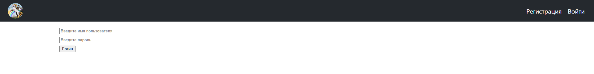
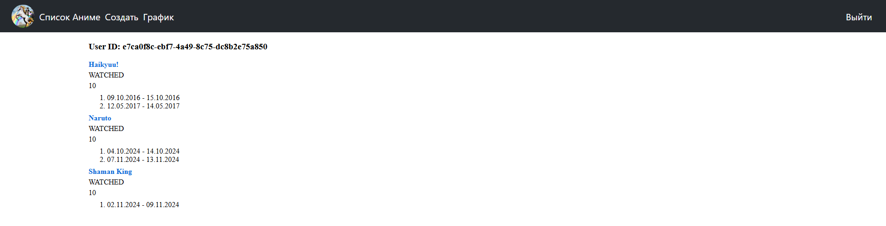
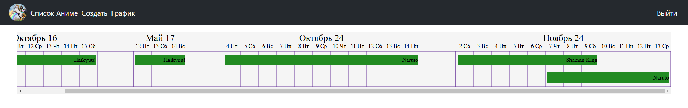
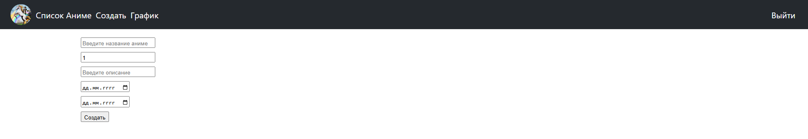

## Technology Stack and Features

### Backend
- ⚡ [**FastAPI**](https://fastapi.tiangolo.com) for the Python backend API.
    - 🔍 [Pydantic](https://docs.pydantic.dev), used by FastAPI, for the data validation and settings management.
    - 💾 [PostgreSQL](https://www.postgresql.org) as the SQL database.
- 🐋 [Docker Compose](https://www.docker.com) for development and production.
- 🔑 [JWT (JSON Web Token)](https://jwt.io) authentication.
- ✅ Tests with [Pytest](https://pytest.org).
- 📫 Email based password recovery.
### Frontend
- 🚀 [React](https://react.dev) for the frontend.
  - Custom gantt chart

### Login form


### Anime list


### Gantt chart


### Anime creation


## How to install with Docker compose
```bash
git clone https://github.com/Quad3/anime_list.git anime-list
```

Move to project folder
```bash
cd anime-list
```

Run docker-compose. It starts Postgres db, FastAPI backend and React frontend.
```bash
docker-compose up
```

Go to http://localhost:3000
